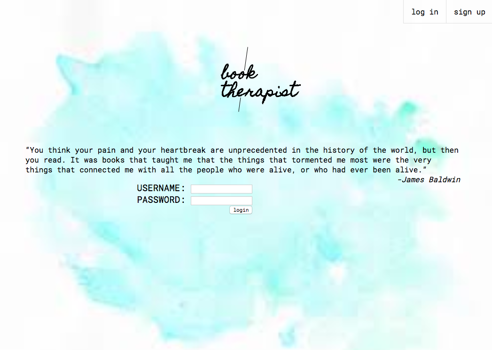
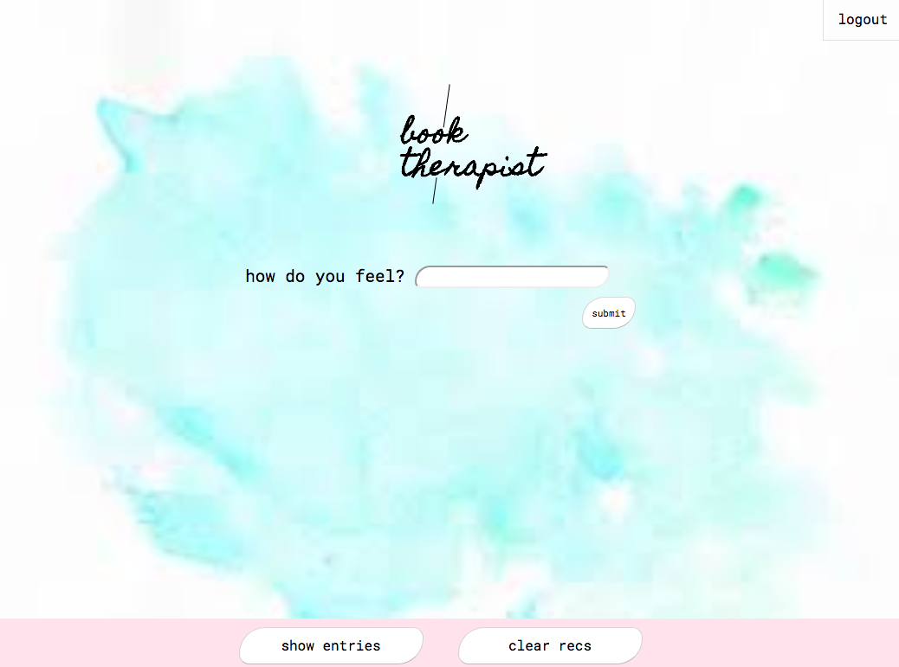
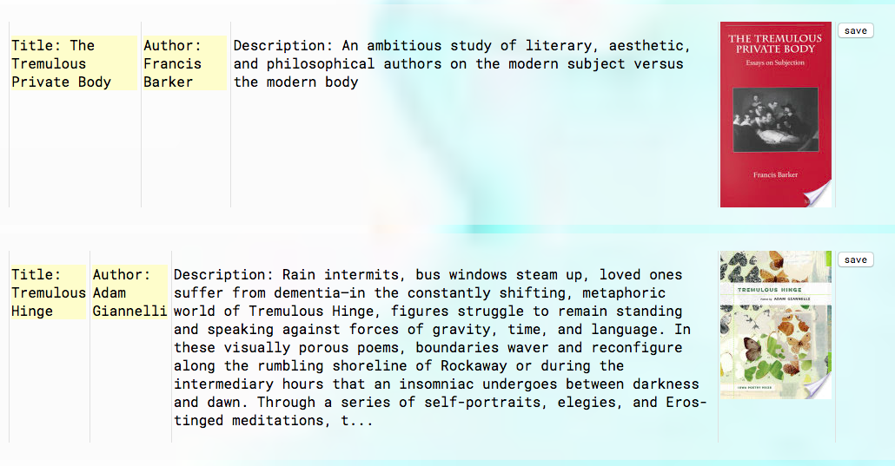
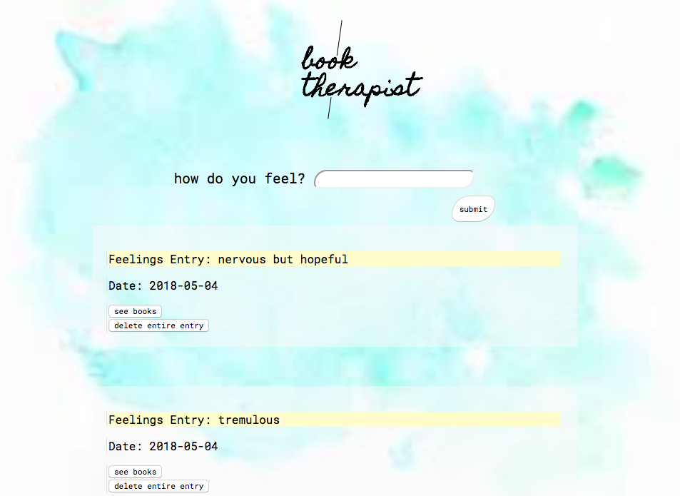
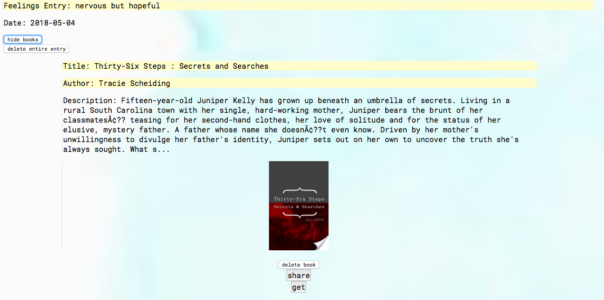

# book-therapist
a book recommendation application. users can sign up and create an account then login to submit a sentiment form to the "book therapist".
the text submitted by user will be used to gather book recommendations from the Google Books API. any / many of the returned book recommendations
can be saved by the user. each saved book updates the sentiment form. the user can view all of her feeling entries and all of the corresponding saved book recommendations.

## motivation
"What a miracle it is that out of these small, flat, rigid squares of paper unfolds world after world after world, worlds that sing to you, comfort and quiet or excite you.

Books help us understand who we are and how we are to behave. They show us what community and friendship mean;
they show us how to live and die." -Anne Lamott

## screenshots
landing page / login and search:

sentiment entry form:

result after submitting sentiment entry form (e.g. 'tremulous'):

can look up all of one's own entries:

can expand entry to see saved book recommendations:

## built with
* Javascript
* JQuery
* HTML5
* node.js

## features
* have a book therapist recommend books to you based on how you are feeling
* can save and share recommendations
